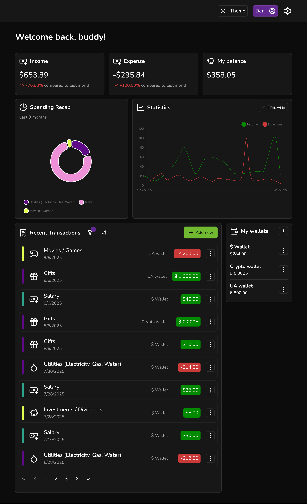
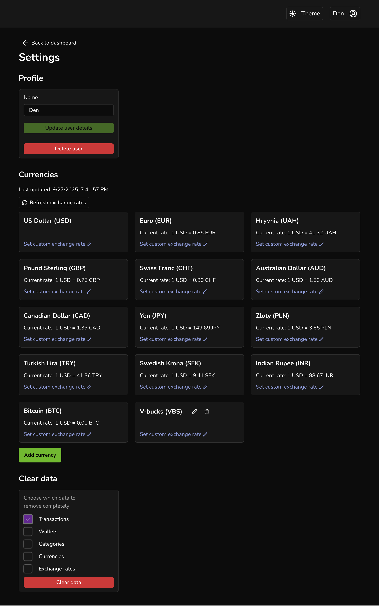

# Budget Buddy

Budget Buddy is a simple personal finance dashboard I built to sharpen my
portfolio. It’s also my very first project with Vue.js, so I used it as a
playground to learn the framework while experimenting with local-first data.

<div style="display:flex;flex-wrap:wrap;gap:10px">
  
  
</div>

## Features

- Dashboard overview: total income, expense, balance
- Transactions management
- Transactions filtering and sorting
- Categories: predefined categories and ability to add custom categories with
  icons/color
- Multi-currency support using [exchangerate.host](https://exchangerate.host/) API and ability to add custom
  currencies
- Wallets management
- Multi-users support
- Local-first storage
- Data visualization: spending overview by categories and line graph of
  income/expense over time
- Dark mode

## Technologies

- Frontend: Vue.js, Typescript, Tinybase, Radix Vue, Chart.js, Tanstack Query
- Testing: Vitest, Cypress
- Code quality: Eslint

## Development

Add exchangerate.host access key to .env.

Run the development servers for frontend:

```bash
pnpm dev
```
